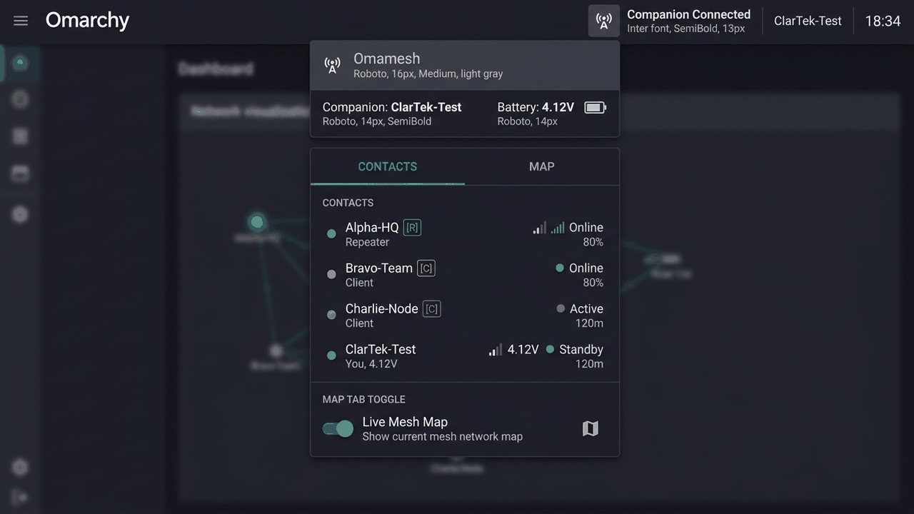

# Omamesh

<p align="center">
  
</p>

<p align="center">
  <a href="https://plugins.omarchy.org/plugin.html?id=clartek.omamesh"></a>
  <a href="LICENSE"></a>
  <a href="https://github.com/clartek/omamesh/releases"></a>
  <a href="https://meshcore.org"></a>
</p>

**Omamesh** is an off-grid LoRa mesh networking companion for **Omarchy Quattro** desktop bars. Powered by `meshcore-cli`, it brings the visual hierarchy, node management, and messaging workflows of the official MeshCore companion directly into your native Linux bar.

---

## Highlights

* 📡 **Multi-Transport Connectivity**: Continuous auto-reconnecting support for **USB Serial** (`/dev/ttyACM*`), **TCP/IP**, and **Bluetooth LE (BLE)** companions.
* 💬 **Messaging with ACK Tracking**: Direct chats and channel broadcasts with verified radio delivery acknowledgments.
* 🔔 **Desktop Notifications**: Instant desktop alerts for incoming direct messages and channel broadcasts.
* 🗺️ **Interactive Slippy Map**: Real-time advertised-contact locator with Esri Dark Canvas basemap and offline coordinate grid modes.
* 📊 **Telemetry & Diagnostics**: Query Cayenne LPP remote sensor metrics, monitor battery voltages, and inspect radio SNR/RSSI signal paths.
* 🔒 **Security Hardened**: Built to Omarchy Quattro security standards—strict argument arrays (no shell invocation), PlainText rendering sinks, and bounded stream parsers.

---

## Feature Matrix

| Feature | Status |
| --- | --- |
| Automatic CLI detection (`meshcore-cli`) | ✅ Working |
| USB Serial companion connection | ✅ Working |
| TCP/IP companion endpoint & auto-reconnect | ✅ Working |
| Bluetooth LE (BLE) companion connection | ✅ Working |
| Companion battery voltage & radio metrics | ✅ Working |
| In-panel connection & transport inspector | ✅ Working |
| Contact discovery, role filtering & search | ✅ Working |
| Channel discovery, creation & deletion | ✅ Working |
| Direct & channel messaging | ✅ Working |
| Radio acknowledgment (ACK) tracking | ✅ Working |
| Remote Cayenne LPP sensor telemetry | ✅ Working |
| Interactive slippy street map (Esri Dark Canvas) | ✅ Working |
| Offline coordinate grid mode | ✅ Working |
| Native Omarchy desktop notifications | ✅ Working |

---

## Requirements

* **Omarchy Quattro** (with Quickshell-based shell)
* [`meshcore-cli`](https://github.com/meshcore-dev/meshcore-cli) installed and accessible on `$PATH`
* A MeshCore companion device connected via **USB Serial**, **TCP/IP**, or **BLE**
* For USB serial, standard dialout/serial group permissions to `/dev/ttyACM*` or `/dev/ttyUSB*`

> **Note**: If `meshcore-cli` is not found, the bar widget safely displays `meshcore-cli not found` and idles without spawning background processes.

---

## Installation

### Standard (Omarchy Marketplace)

The recommended installation method via the [Omarchy Plugin Store](https://plugins.omarchy.org/plugin.html?id=clartek.omamesh):

```bash
omarchy plugin add clartek.omamesh
```

### Manual (From Source)

To install or develop from source:

```bash
git clone https://github.com/clartek/omamesh.git ~/.config/omarchy/plugins/clartek.omamesh
omarchy plugin enable clartek.omamesh
omarchy restart shell
```

---

## Controls & Keybindings

Omamesh is designed for rapid keyboard and mouse navigation:

| Action | Shortcut / Gesture |
| :--- | :--- |
| **Toggle Panel** | Click bar icon or configured Omarchy bar toggle |
| **Refresh Companion** | Middle-click bar icon, or press `R` / `Enter` inside panel |
| **Search Contacts / Channels** | Press `/` on Contacts or Channels tab |
| **Switch Tabs** | Press `1` / `2` / `3` or `H` / `L` (Contacts, Channels, Map) |
| **Connection Inspector** | Click the transport icon (`󰒋`) in the header |
| **Map Zoom & Pan** | Click-and-drag to pan; scroll wheel or `+` / `-` to zoom |
| **Fit All Contacts** | Click the target crosshair (`󰆤`) on the Map tab |
| **Toggle Map Tiles / Grid** | Press `T` on the Map tab |
| **Back / Close** | Press `Escape` |

---

## Network Activity & Privacy

* **Companion Traffic**: Omamesh communicates with `meshcore-cli` locally via bounded UNIX pipes. No credentials, tokens, or encryption keys are ever logged.
* **Map Tiles**: When online tiles are enabled (`enableMapTiles: true`), raster basemap tiles are fetched over HTTPS from Esri (`server.arcgisonline.com:443`) or OpenStreetMap. No user identifiers or location telemetry are sent with tile requests.
* **Offline Mode**: When online tiles are disabled, Omamesh operates 100% offline using a mathematical coordinate grid.
* **Sensitive Data Protection**: Channel keys and secrets are immediately discarded upon normalization. Contact identifiers are hashed/shortened in UI sinks.

---

## Testing & Validation

Run the automated test suite locally:

```bash
./scripts/check
```

This verifies metadata syntax, executes pure `Model.js` unit tests, validates TCP/BLE/Serial transport sessions, runs message and sensor telemetry smoke tests, and verifies Omarchy plugin schema compliance.

---

## Removal

To uninstall Omamesh:

```bash
omarchy plugin remove clartek.omamesh
```

Omamesh leaves no residual files in `/tmp`, `/var`, or `/etc`, creates no persistent systemd units, and touches no desktop keyrings.

---

## Architecture

```text
BarWidget.qml                   Compact bar indicator & panel host
Panel.qml                       Keyboard-friendly companion dropdown surface
MeshCoreService.qml             Process lifecycle, auto-reconnect & normalized state
Model.js                        Pure validation, transport parsers & display helpers
manifest.json                   Plugin manifest & settings schema
preview.png                     High-contrast marketplace showcase
fixtures/                       Sanitized offline fixture datasets
tests/                          Transport, parsing, and model test suites
scripts/check                   All-in-one local validation script
docs/architecture.md            Transport and state architecture design
docs/DEVELOPMENT.md             Development conventions and security policies
docs/meshcore-cli-contract.md   Verified backend CLI behavior and semantics
```

---

## Acknowledgments

Omamesh is an independent community project. Its visual hierarchy is inspired by Liam Cottle's official MeshCore companion app. Protocol semantics are validated against official MeshCore documentation, `meshcore-cli`, and [`meshcore.js`](https://github.com/meshcore-dev/meshcore.js).

---

## License

Distributed under the [MIT License](LICENSE).
